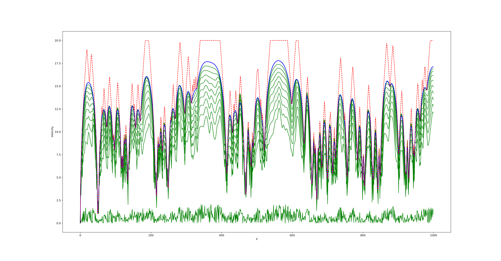

# Daisy Intelligence Hackathon 2019

Solution for the optimization problem at the [Daisy Intelligence](https://www.daisyintelligence.com/) hackathon in January 2019. I worked with Leon Yao over the course of 12 hours.

## About the code

The original solution submitted for the hackathon is contained in the `orig` folder. Some of the critical pieces were written in the last few hours of the competition so it is rather messy and probably hard to understand. It only needs `numpy` and `matplotlib` (because there is some debugging sprinkled randomly throughout) to run.

A cleaner version using PyTorch written after the hackathon is in the `torch` folder. The output is essentially equivalent but uses the autograd mechanics of PyTorch instead of the manually computed gradients in the original solution. This is the solution I describe below.

## Problem

The goal is to optimize the acceleration and breaking of a race car to minimize time spent, constrained at each position by a varying maximum speed and a limited amount of fuel which is consumed during acceleration. The exact values of these constraints depend on the chosen tier for each constaint. 

## Optimization

Given a particular car configuration, the problem is to use the given fuel and tire limits as efficiently as possible. The strategy is to optimize within the space of legal solutions that use either the gas or the tire entirely. We also optimize on the vector of velocities rather than on the accelerations because changes to a single velocity have only local changes while acceleration changes are compounding.

So we first form the vector of maximum possible velocities based on the track and limits on acceleration/breaking. This is acheived with one forward and backward pass over the velocities, limitting each velocity based on its neighbors.

Now we define a solution as a vector of numbers which scale down the velocity from the maximum allowed at each point. This may use more than the allowed gas or tire, but we can always scale a solution to just use up one or the other. We evaluate the solution by taking these scaled values for the velocities and computing the time. Now doing gradient descent to minimize the time gives a convergent solution.

(The red line is the maximum possible velocity. The green lines show the convergence of the solution from completely random to the smooth curve at the top.)
